# Route-Optimization
Route optimization project using Graph Neural Networks (GNN) for efficient planning. Optimizes routes across truck, rail, and ocean transport, minimizing cost, time, GHG emissions, and fuel usage.

```mermaid
flowchart TD
    subgraph "Data Inputs"
        A[Supply Chain Network Data] --> A1[Vendors]
        A[Supply Chain Network Data] --> A2[Production Plants]
        A[Supply Chain Network Data] --> A3[Distribution Centers]
        A[Supply Chain Network Data] --> A4[End Customers]
        
        B[Transportation Data] --> B1[Truck Routes]
        B[Transportation Data] --> B2[Rail Networks]
        B[Transportation Data] --> B3[Ocean Shipping Lanes]
        
        C[Constraint Parameters] --> C1[Capacity Limits]
        C[Constraint Parameters] --> C2[Time Windows]
        C[Constraint Parameters] --> C3[GHG Emission Targets]
        C[Constraint Parameters] --> C4[Budget Constraints]
    end
    
    subgraph "Graph Construction"
        D[Build Multi-Modal Graph]
        D1[Nodes: Vendors, Plants, DCs, Customers]
        D2[Edges: Transportation Links]
        D3[Edge Attributes: Cost, Time, GHG, Mode]
        
        D --> D1
        D --> D2
        D --> D3
    end
    
    subgraph "GNN Framework"
        E[Graph Neural Network]
        E1[Node Embedding Layer]
        E2[Message Passing Layer]
        E3[Graph Attention Layer]
        E4[Path Scoring Layer]
        
        E --> E1
        E1 --> E2
        E2 --> E3
        E3 --> E4
    end
    
    subgraph "Multi-Objective Optimization"
        F[Pareto Optimization]
        F1[Cost Minimization]
        F2[GHG Emission Reduction]
        F3[Service Level Maximization]
        
        F --> F1
        F --> F2
        F --> F3
    end
    
    subgraph "Route Recommendation Engine"
        G[Optimal Route Selection]
        G1[Mode Selection: Truck/Rail/Ocean]
        G2[Vendor-Plant Assignments]
        G3[Plant-DC-Customer Flows]
        
        G --> G1
        G --> G2
        G --> G3
    end

    A --> D
    B --> D
    C --> D
    D --> E
    E --> F
    F --> G
    
    style A fill:#d4f1f9,stroke:#05a8e6
    style B fill:#d4f1f9,stroke:#05a8e6
    style C fill:#d4f1f9,stroke:#05a8e6
    style D fill:#ffe6cc,stroke:#ff9900
    style E fill:#e1d5e7,stroke:#9673a6
    style F fill:#d5e8d4,stroke:#6c8ebf
    style G fill:#f8cecc,stroke:#b85450
```

