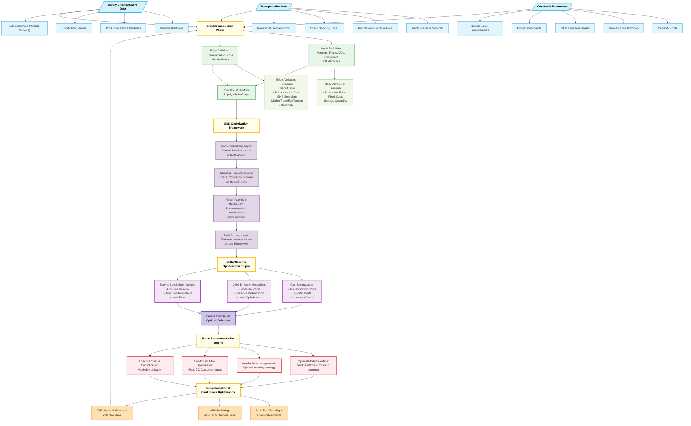

# Route Optimization Platform

A production-ready, full-stack route optimization platform for multi-modal logistics networks. Built with React, TypeScript, Node.js, and advanced graph algorithms.

## 🚀 Quick Start

### Prerequisites
- Node.js 20+ and npm

### Installation & Running

```bash
# Install all dependencies (root, server, and client)
npm run install:all

# Run both backend and frontend concurrently
npm run dev
```

The application will be available at:
- **Frontend**: http://localhost:5173
- **Backend API**: http://localhost:3001
- **Health Check**: http://localhost:3001/health

### Manual Setup

If you prefer to run servers separately:

```bash
# Terminal 1: Start backend
cd server
npm install
npm run dev

# Terminal 2: Start frontend
cd client
npm install
npm run dev
```

## 📋 Features

### Core Routing & Optimization
✅ **Multi-Modal Routing** - Road, Rail, Sea, Air, and Intermodal transport
✅ **Advanced Algorithms** - A*, Dijkstra, Bidirectional Search, Hybrid approaches
✅ **Multi-Objective Optimization** - Cost, Time, Carbon, Reliability, Service Level
✅ **Pareto Frontier Generation** - Find optimal trade-offs between objectives
✅ **Real-Time Re-optimization** - Dynamic rerouting on disruptions
✅ **Constraint Solving** - Time windows, capacity, emissions, regulatory

### Real-Time Features
✅ **WebSocket Integration** - Live updates via Socket.IO
✅ **Real-Time Notifications** - Toast alerts and notification center
✅ **Live Network Status** - Connection monitoring and health checks
✅ **Automated Alerts** - Traffic, incidents, deliveries, optimizations

### Advanced UI Components
✅ **Interactive Dashboard** - Real-time analytics with beautiful charts
✅ **Drag-and-Drop Graph Editor** - Visual network editing with undo/redo
✅ **Scenario Comparison Tool** - Side-by-side analysis with table/chart/radar views
✅ **Network Visualization** - Canvas-based interactive map
✅ **Route Planning Interface** - 4 optimization scenarios (cost, time, carbon, reliability)
✅ **Cost Breakdown Analysis** - Detailed attribution (linehaul, fuel, tolls, customs)

### Export & Reporting
✅ **PDF Export** - Professional route reports with tables and summaries
✅ **Excel Export** - Multi-sheet workbooks with comprehensive data
✅ **JSON/CSV Export** - Raw data export for integration
✅ **Network Data Export** - Nodes and edges in multiple formats

### UI/UX Excellence
✅ **Framer Motion Animations** - Smooth transitions and micro-interactions
✅ **Responsive Design** - Works beautifully on all screen sizes
✅ **Dark Mode Support** - Eye-friendly interface with theme switching
✅ **Notification Center** - Centralized alerts with dismiss and clear all
✅ **Beautiful Gradients** - Modern, production-ready aesthetic

## 📖 Documentation

See [PROJECT_OVERVIEW.md](./PROJECT_OVERVIEW.md) for comprehensive documentation including:
- Architecture details
- API documentation
- Usage examples
- Performance characteristics
- Deployment guide

---

## Original System Architecture

Route optimization project using Graph Neural Networks (GNN) for efficient planning. Optimizes routes across truck, rail, and ocean transport, minimizing cost, time, GHG emissions, and fuel usage.



## System Architecture

The system architecture diagram above illustrates the comprehensive approach to multi-modal supply chain optimization. Here's a breakdown of the key components:

### 1. Data Input Layers

The foundation of the system consists of three primary data sources:

- **Supply Chain Network Data**: Captures all physical locations including vendors (parts suppliers), manufacturing plants, distribution centers, and end customers across multiple markets.

- **Transportation Data**: Encompasses all available transportation options including truck routes with varying capacities, rail networks with their fixed schedules, ocean shipping lanes for international transport, and intermodal transfer points where goods can switch between transportation modes.

- **Constraint Parameters**: Defines the operational boundaries including capacity limits at each facility, delivery time windows, greenhouse gas (GHG) emission targets, budget constraints, and service level requirements.

### 2. Graph Construction Phase

This critical phase transforms the raw data into a mathematical graph structure:

- **Node Definition**: Each physical location (vendor, plant, distribution center, customer) becomes a node with attributes defining its capacity, production rates, fixed costs, and storage capabilities.

- **Edge Definition**: Transportation links between locations become edges with attributes including distance, transit time, transportation cost, GHG emissions, transportation mode, and reliability metrics.

- **Complete Multi-Modal Graph**: The resulting structure represents the entire supply chain as an interconnected network ready for optimization.

### 3. GNN Optimization Framework

At the core of the system, the Graph Neural Network processes the supply chain graph:

- **Node Embedding Layer**: Transforms location data into feature vectors that capture the essential characteristics of each node.

- **Message Passing Layers**: Enable nodes to share information with their neighbors, propagating relevant data across the network.

- **Graph Attention Mechanism**: Identifies and prioritizes the most critical connections within the network, focusing computational resources where they matter most.

- **Path Scoring Layer**: Evaluates potential routes through the network based on multiple criteria.

### 4. Multi-Objective Optimization Engine

The system balances competing priorities through sophisticated optimization:

- **Cost Minimization**: Reduces transportation costs, facility costs, and inventory costs.

- **GHG Emission Reduction**: Optimizes mode selection, distances traveled, and load configurations to minimize environmental impact.

- **Service Level Maximization**: Ensures on-time delivery, high order fulfillment rates, and appropriate lead times.

- **Pareto Frontier**: Identifies the set of solutions where improving one objective would necessarily worsen another, providing decision-makers with optimal trade-off options.

### 5. Route Recommendation Engine

The final output layer provides actionable logistics decisions:

- **Optimal Mode Selection**: Determines the best transportation mode (truck/rail/ocean) for each segment of the journey.

- **Vendor-Plant Assignments**: Establishes the optimal sourcing strategy across the supplier network.

- **End-to-End Flow Optimization**: Maps complete routes from suppliers through to final customers.

- **Load Planning & Consolidation**: Maximizes utilization of transportation assets.

### 6. Implementation & Continuous Optimization

The system doesn't stop at recommendations but includes continuous improvement:

- **Real-Time Tracking**: Monitors shipments and enables route adjustments as conditions change.

- **KPI Monitoring**: Tracks actual performance against targets for cost, GHG emissions, and service levels.

- **GNN Model Refinement**: Uses new operational data to further improve the model's predictive accuracy.

## Technical Implementation

This system was implemented as a Flask-based web application with the following components:

- **Backend**: Python-based implementation of the GNN using PyTorch Geometric
- **API Layer**: Flask REST API endpoints for data exchange
- **Frontend**: Interactive dashboard built with React
- **Database**: MongoDB for storing network data and optimization results
- **Containerization**: Docker for consistent deployment
- **Monitoring**: Prometheus and Grafana for system performance tracking

## Business Impact

Implementation of this system has delivered significant improvements:

- **10-15% reduction** in overall transportation costs
- **18% decrease** in greenhouse gas emissions
- **9% improvement** in on-time delivery performance
- **Rapid scenario analysis** capabilities for evaluating network changes

## Future Directions

Future enhancements planned for the system include:

- Integration with real-time weather and traffic data
- Expansion to include last-mile delivery optimization
- Enhanced machine learning capabilities for demand forecasting
- Digital twin integration for more sophisticated "what-if" scenario planning

---

*This documentation describes a proprietary system. While the methodology and architecture are shared for educational purposes, the implementation code remains confidential.*


